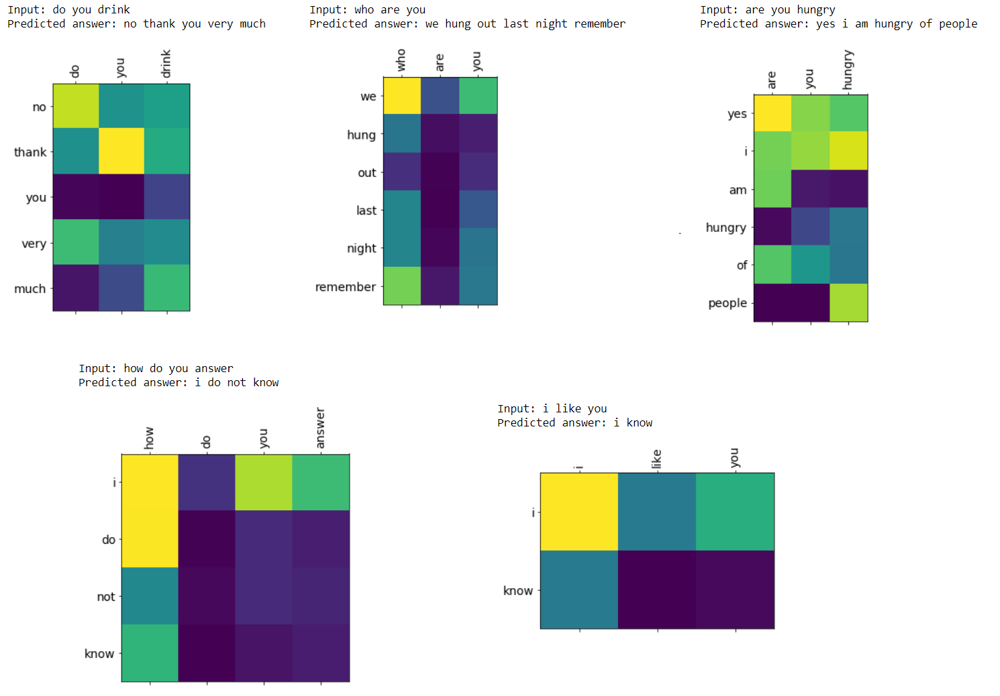

# Chatbot-with-TensorFlow-and-Keras
 
### Dataset:  

 Cornell Movie Dialogs corpus contains a large metadata-rich collection of fictional conversations extracted from raw movie scripts.
 The corpus includes:
- 220,579 conversational exchanges between 10,292 pairs of movie characters
- involves 9,035 characters from 617 movies
- in total 304,713 utterances

I have used only 96048 pairs of these dialogs.

### Model:

The encoder is 1-layer Bi-directional GRU with 256 units and decoder is 2-layer Uni-directional GRU with 512 units. I utilized Bahdanau Attention as my attention model.

### Results:

You can observe how the model decided to generate the output based on the input. For each pair of words from input and output the attention weight is visualized.

### Tips for training the model:

* I used small batch size of 32 for more stable training.
* Instead of feeding a whole sequence to the network, I have fed time step x of a batch of data to the network.
* I used bidirectional GRU as the encoder, but decoder is unidirectional. It is due to the fact that input is known but output is generated at each step.
* I used Masked Loss. The loss for the padding inputs are considered 0.
* It is more desirable to use a low dimenstion word embeddings with a simple model. I used 50-d GloVe word vectors.
* I applied dropout with a chance of 0.2 to encoder's input word embeddings .

### Setup:

* I trained the model on a Nvidia 1070-Ti GPU. Each epoch took about 3.5 mins

### Helpful tutorials:

* https://homes.cs.washington.edu/~msap/notes/seq2seq-tricks.html
* https://machinelearningmastery.com/configure-encoder-decoder-model-neural-machine-translation/
* https://pytorch.org/tutorials/beginner/chatbot_tutorial.html
* https://www.tensorflow.org/tutorials/text/nmt_with_attention
